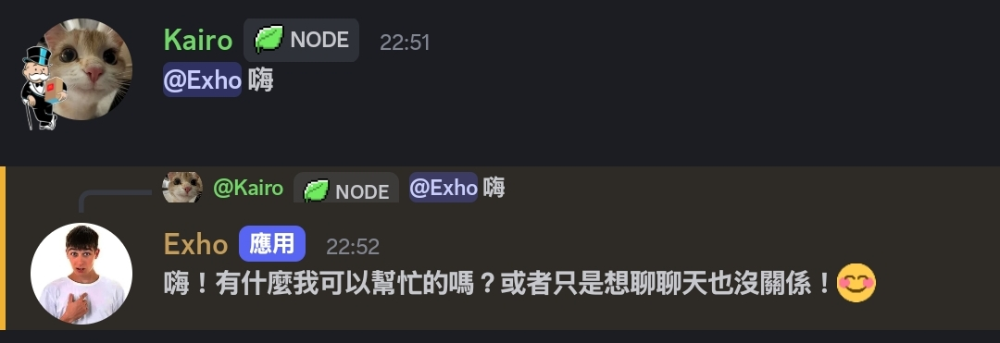
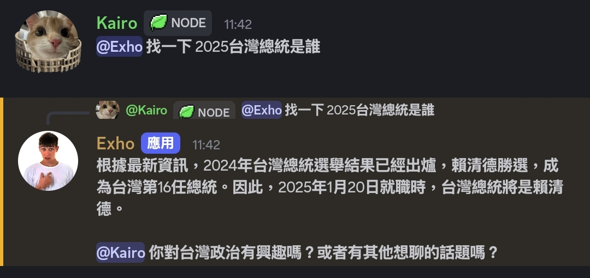
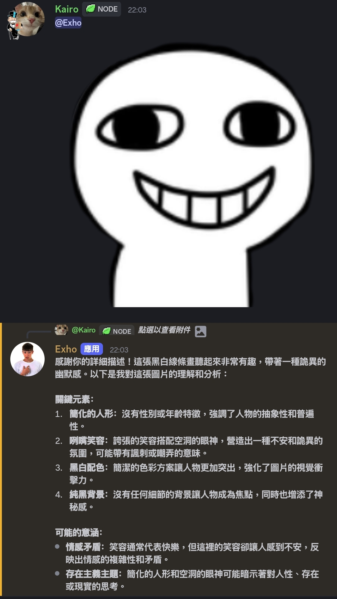

# Exho BOT LLM AI機器人

<p align="center">
  <a href="https://discord.gg/umKvqHj4DC">
    
  </a>
</p>

**[繁體中文](README.md) | [English](README_en.md)**

---

## 🌟 簡介
**Exho** 是一個多模態智慧 LLM AI 機器人，支援文字與圖片輸入，能與使用者互動、分析圖片、回答問題，甚至輔助程式開發與創意內容生成。  
它完全基於雲端 LLM（如 Cohere AI），無需本地模型即可運作，為 Discord 提供即時智能體驗。

---

## 🚀 主要功能
- **智慧對話**：自然語言理解與回應，模擬多種角色語氣。
- **圖片理解**：分析圖片內容、辨識文字、生成描述。
- **程式輔助**：撰寫程式範例、協助 Debug、提供建議。
- **多模型切換**：可依需求自動選擇最適合的 LLM 模型。
- **互動遊戲**：簡單文字遊戲、冒險、互動問答。
- **多模態整合**：文字＋圖片＋語音（未來擴充）模式。

---

## 📲 展示功能





---

## 🔧 開始使用

### 🖥️ 架設需求

*   **基本依賴項目：**
    *   [Node.js 18+](https://nodejs.org/zh-tw/download)
    *   [Discord.js](https://discord.js.org/) （npm install discord.js）
    *   [`package.json`]
*   **記憶體需求：**
    *   **RAM**：建議使用 500MB 以上記憶體。

## 🛠 安裝與部署
```bash
# 一行一行複製
# 克隆倉庫
git clone https://github.com/kairo0916/ai-exho-discord-bot.git
cd exho-bot

# 安裝依賴
npm install

# 啟動機器人
node bot.js
```

## ⚙️ 設定

**請按照以下步驟設定機器人。**

### 步驟 1：設定 `.env` 檔案

將 `.env.Example` 檔案重新命名為 `.env` 並填入所需的值。

```env
# .env

DISCORD_TOKEN=Discord-Bot-Token
DISCORD_BOT_ID=Discord-Bot-Id
DISCORD_SECURE_KEY=Discord-Bot-Secure-Key

COHERE_API_KEY=Cohere-api-key

URL_CHECK_API_KEY=可省略
IP_LOOKUP_API_KEY=可省略

GEMINI_API_KEY=Gemini-api-key

SEARCH_API_KEY=選填，不填就沒搜尋功能
SEARCH_ENGINE_ID=選填，不填就沒搜尋功能

# ============================

ADMIN_ROLE_IDS=管理員身分組數字ID

MEMORY_LIMIT=AI上下文數值，例 50

TEXT_MODEL=command-r-03-2025
VISION_MODEL=gemini-2.0-flash

BOT_VERSION=V1.1.0
SERVER_LINK=你的支援群連結

DEV_USER=開發者1號使用者ID,開發者2號使用者ID（以此類推）

BAN_CHANNEL=封鎖通知的頻道ID

PREFIX_REPLY=是否開啟回文指令
PREFIX=回文指令前綴，例填：$ 就是長這樣：$status

PTERO_API_KEY=Pterodactyl面板使用者API Key
PTERO_URL=Pterodactyl面板連結，請包含 https:// http://
SERVER_ID=Pterodactyl伺服器ID

REDIS_HOST=Redis伺服器IP
REDIS_PORT=Redis伺服器端口
REDIS_PASS=Redis伺服器密碼

DB_USER=MairaDB使用者名稱
DB_NAME=MairaDB名稱
DB_HOST=MairaDB伺服器IP
DB_PORT=MairaDB伺服器端口
DB_POOL_MAX=MairaDB連線最大數量，例如 20
```

### 步驟 2：查看 `./data` 資料夾內有沒有包含這些：

**請添加下列檔案並輸入內容。**

1. `banlist.json` = `[]`
2. `report_time.json` = `{}`
3. `last_status_message.json` = `{}`
4. `marriage.json` = `{}`
5. `used_command.txt` = 不需要輸入，程式自動偵測，但也請新增此檔案。

### 步驟 3：啟動機器人

**設定完成後，使用指令把機器人開機：**

```bash
node bot.js
```

### 📝 備註：

**可使用 `node update.js` 更新機器人喔！**

## ℹ️ 功能總覽

**下列為目前機器人擁有的大概功能：**

---

### 🧠 智慧大腦
* **描述：使用 Cohere AI 進行對話，支援上下文、長期記憶、自然對話..等功能。**

---

### 🌐 網路搜尋
* **描述：使用 Google Custom JSON API 進行 Google 搜尋，並經過分析後給予結果。

---

### 👤 記憶系統
* **描述：長期保存使用者與機器人的對話，優化上下文功能。**

---

### 🖼️ 圖片檢視
* **描述：使用 Gemini 2.0 Flash 模型查看圖片（若使用此功能請填寫 GEMINI_API_KEY）（可至 .env 修改模型 VISION_MODEL 欄位）。**

## 目前功能少，還請各位踴躍投稿或回報👍

---

### 此專案由 MIT 保護
